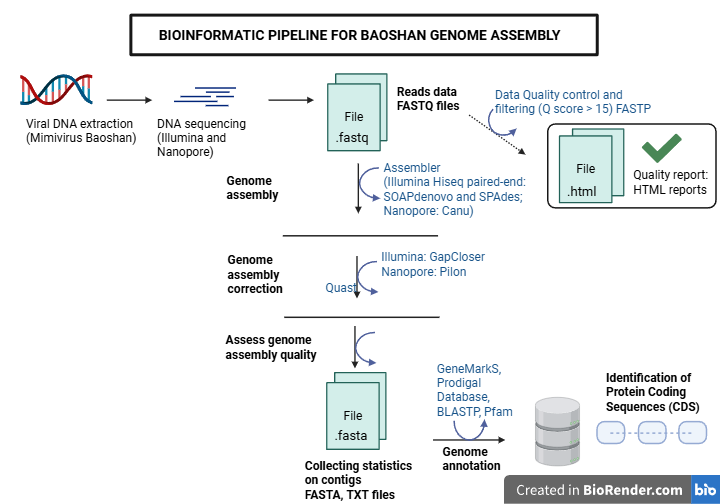

# Personal project 2 about viruses

## Table of content
1. [Description](#descrp)
2. [Requirements](#req)
3. [Usage](#usage)
4. [Authors](#authors)
5. [References](#references)


<a name="descrp"></a>

## Description
The goal of this project is to learn about viruses and reproduce results and analysis from scientific articles.

The pipeline is designed as follow:



## Requirements

#### Install miniconda3: 

[Miniconda](https://docs.conda.io/en/latest/miniconda.html#linux-installers)

#### Install Miniforge3 for Linux:

[Miniforge3](https://github.com/conda-forge/miniforge?tab=readme-ov-file)

Then, close and re-open your terminal window and run ```which conda``` to see if conda is well installed and where it is installed.

#### Install your environment from a .yml file:

[Environment](https://conda.io/projects/conda/en/latest/user-guide/tasks/manage-environments.html#activating-an-environment)

Run ```conda env create -f environment.yml``` to install the environment from a .yml file.

Run ```conda activate myenv``` to activate the environment.

<a name="usage"></a> 

## Usage

<a name="authors"></a> 

## Author
This project is developed by Chloé Aujoulat.

<a name="references"></a> 

## References

### Documentation
- SRA NCBI database: 
    - Website: https://www.ncbi.nlm.nih.gov/sra
- SRA toolkit:
    - Websites: 
        - https://hpc.nih.gov/apps/sratoolkit.html 
        - https://github.com/ncbi/sra-tools/wiki
- FastQC: https://www.bioinformatics.babraham.ac.uk/projects/fastqc/ 

### Tutorials
- Downloading data from SRA NCBI database: 
    - https://bioinformatics.ccr.cancer.gov/docs/b4b/Module1_Unix_Biowulf/Lesson6/

### Articles
- Xia, Yucheng, Huanyu Cheng, et Jiang Zhong. « Hybrid Sequencing Resolved Inverted Terminal Repeats in the Genome of Megavirus Baoshan ». Frontiers in Microbiology 13 (mai 2022): 831659. https://doi.org/10.3389/fmicb.2022.831659.

